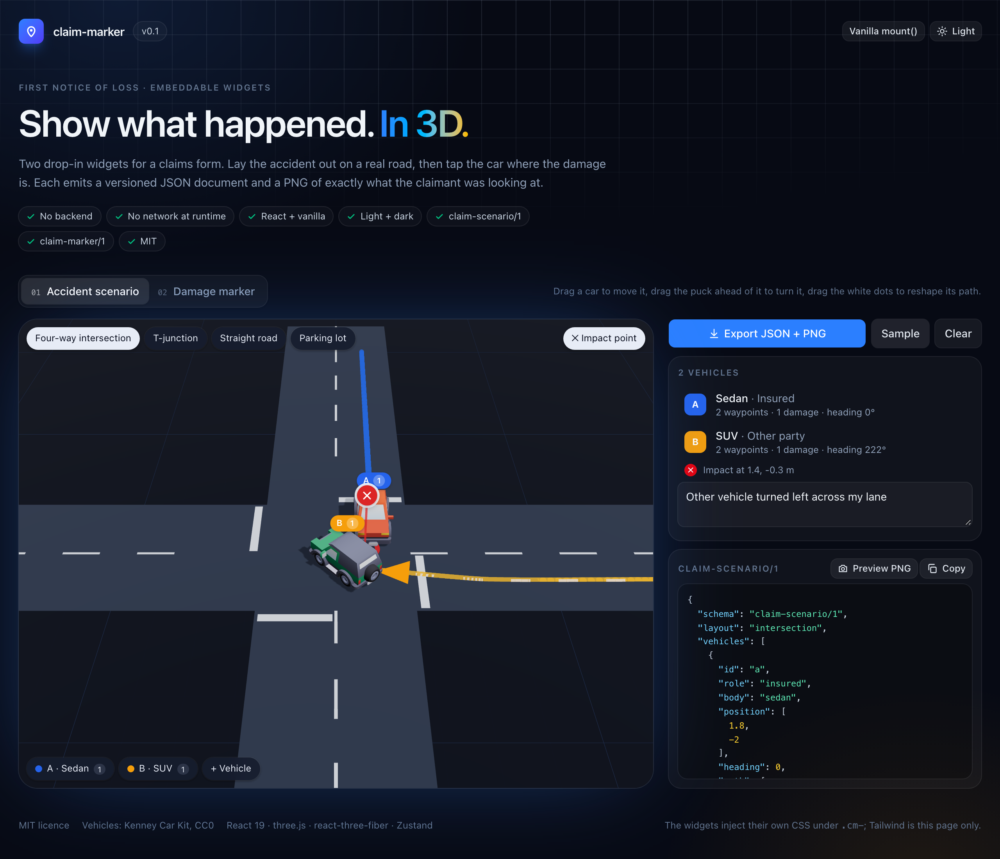
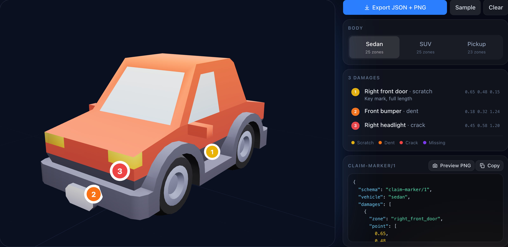
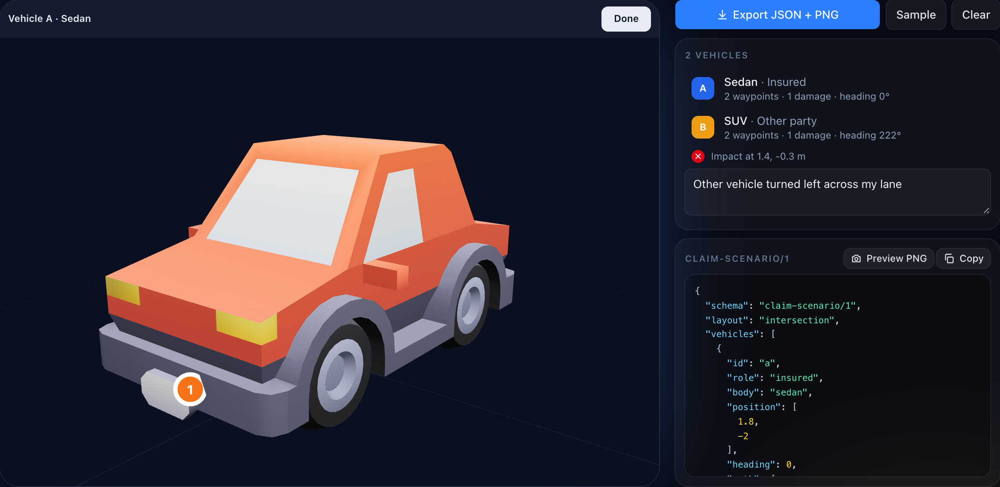

<h1 align="center">claim-marker</h1>

<p align="center">
  Two embeddable 3D widgets for insurance claims.<br>
  Lay out how the accident happened, and mark where the damage is. Both emit structured JSON and a PNG.<br>
  Light and dark, no backend, nothing fetched at runtime.
</p>

<p align="center">
  
</p>

<p align="center">
  <sub>React 19 · TypeScript · three.js · react-three-fiber · Zustand · MIT</sub>
</p>

---

## What this is

First-notice-of-loss forms still ask where the damage is with a clip-art car outline and a grid of
checkboxes, and ask how it happened by dragging two flat icons around a picture of a junction. This
replaces both steps with real 3D the claimant can rotate and tap.

What comes out is not a checkbox. It is a named zone, the exact 3D point that was tapped, a
severity, each vehicle's position, heading and travel path, the point of impact — and a picture of
the whole thing for the file.

These are widgets, not an app. No backend, no accounts, no AI. They drop into a form you already
have.

| | |
| --- | --- |
|  |  |
| **Damage marker** — hover names the panel, tap it, pick a severity; pins are numbered and tapping one flies the camera to it | **Integrated** — mark a scenario vehicle's damage in place |

## Quick start

```bash
npm install
npm run dev      # demo at http://localhost:5173
```

## Embedding

```bash
npm install claim-marker react react-dom three
```

**React**

```tsx
import { useRef } from 'react'
import { ScenarioBuilder, DamageMarker } from 'claim-marker'
import type { ScenarioHandle, DamageMarkerHandle } from 'claim-marker'

function ClaimStep() {
  const scenario = useRef<ScenarioHandle>(null)

  return (
    <div style={{ height: 560 }}>
      <ScenarioBuilder ref={scenario} onChange={(v) => console.log(v.vehicles.length, 'vehicles')} />
      <button onClick={() => {
        const { json, png } = scenario.current!.export()   // png is a data URL
        submitClaim(json, png)
      }}>
        Continue
      </button>
    </div>
  )
}
```

`<DamageMarker />` has the same shape and is useful on its own when you only need the damage step.
Pass `value` / `onChange` to run either controlled; omit both for uncontrolled and read the state
with `export()`. Both take `theme="dark"` for a dark portal.

**Vanilla**

```js
import { mount, mountScenario } from 'claim-marker'

const diagram = mountScenario(document.getElementById('scenario'), {
  theme: 'dark',
  onChange: (value) => console.log(value),
})

const { json, png } = diagram.export()
diagram.load(savedJson)   // reopen what the customer built
diagram.destroy()
```

`mount(el, options)` is the damage-marker equivalent. Both return synchronously, so the handle
works on the very next line. The container needs a height — the widget fills it.

## The schemas

Two sibling documents, versioned from day one. The scenario embeds the marker's damage shape
rather than redefining it, so a stored claim stays readable and neither had to break for the other.

**`claim-scenario/1`**

```json
{
  "schema": "claim-scenario/1",
  "layout": "intersection",
  "vehicles": [
    {
      "id": "a",
      "role": "insured",
      "body": "sedan",
      "position": [1.8, -2],
      "heading": 0,
      "path": [[1.8, -20], [1.8, -10]],
      "damages": [
        { "zone": "front_bumper", "point": [0.18, 0.32, 1.24], "severity": "dent", "note": "" }
      ]
    }
  ],
  "impact": [1.4, -0.3],
  "note": "Other vehicle turned left across my lane"
}
```

`position` and `impact` are ground-plane `[x, z]` in metres. `heading` is Y-rotation in radians,
nose at +Z when 0. `path` is the approach and `position` is where the vehicle came to rest — kept
independent, so dragging a car never silently rewrites its own path; the arrow is drawn through
`[...path, position]`.

**`claim-marker/1`**

```json
{
  "schema": "claim-marker/1",
  "vehicle": "sedan",
  "damages": [
    { "zone": "right_front_door", "point": [0.65, 0.48, 0.15], "severity": "scratch", "note": "Key mark" }
  ]
}
```

`point` is where the tap landed in the vehicle's own frame: **nose at +Z, up +Y, the car's right at
+X and its left at −X** — left and right as seen from the driver's seat, the insurance convention.

Coordinates round to the millimetre and headings to four decimals, so `export → load → export` is
byte-identical for both documents. That round trip is a test.

`parse(input)` and `parseScenario(input)` validate host-supplied JSON. A structurally wrong value
throws; a single malformed damage or vehicle is dropped rather than losing the rest, and the count
comes back as `rejected`.

### Layouts

`intersection` · `t_junction` · `straight` · `parking_lot`. Each is one small function composed
from two primitives, so another one is a small addition rather than new machinery.

### Vehicles and zones

Three CC0 bodies — `sedan`, `suv`, `truck` (a single-cab pickup). **Zone sets differ per body**,
which is the whole reason zones are data:

| | |
| --- | --- |
| **Shared** | `front_bumper` `hood` `windshield` `roof` `rear_window` `trunk` `rear_bumper` |
| **Per side**, `left_` / `right_` | `headlight` `front_fender` `mirror` `front_door` `rear_door` `rear_quarter_panel` `taillight` `front_wheel` `rear_wheel` |

The pickup has **no rear doors** and its rear flank is a `bed_side`, not a quarter panel — 23 zones
against the sedan's and SUV's 25. `parse` validates a damage's zone against its own vehicle's set,
so a rear-door damage on a pickup is rejected rather than stored.

A tap raycasts the body and the zone is the nearest anchor point to the hit. Anchors are placed
against a vertex sample of each mesh (`scripts/profile-body.mjs`), and a test asserts no two
anchors on a body sit within 15 cm of each other, which is what would make one unreachable.

### Severities

`scratch` · `dent` · `crack` · `missing`. Fixed — a claims form does not want a free-text severity
field.

## API

| | |
| --- | --- |
| `<ScenarioBuilder />` | `value` `onChange` `theme` `className` `style` `ref` |
| `<DamageMarker />` | the same, plus `vehicle` and `modelUrl` |
| `mountScenario(el, opts)` | → `{ export, load, destroy }` |
| `mount(el, opts)` | → `{ export, load, destroy }` |

Both `export()` calls return `{ json, png }`, where `png` is a data URL of the current view —
literally what the user is looking at.

### Theming

`theme` is `light` (default) or `dark`. Everything DOM-side is a CSS custom property on the
widget's root — `--cm-bg`, `--cm-panel`, `--cm-text`, `--cm-muted`, `--cm-line`, `--cm-accent`
and friends, see `src/style.ts` — so a third look is a stylesheet rule on `.cm-root`, not a
fork. The few colours WebGL cannot read from CSS (the clear colour, the road, the grid) come
from the exported `THEME` table.

## Notes for integrators

- **No network at runtime.** The models are inlined into the bundle and the lighting is built from
  lightformers, not a hosted HDRI. Nothing is fetched from a CDN while your form is open.
- **861 kB, 221 kB gzipped** — of which 807 kB is the three vehicle models, base64-inlined, and
  55 kB is code.
  `react`, `react-dom` and `three` are peer dependencies, so you get one copy of three.js, not two.
  If that size matters, the fix is separate entry points; see [the spec](docs/spec-scenario.md).
- **Styling is self-contained.** The widgets inject their own CSS scoped under `.cm-`. They do not
  need Tailwind and will not touch your styles. Override the `--cm-*` custom properties to restyle.
- **The marker turns slowly until it is touched**, which is how a claimant learns it can be
  rotated. Tapping a pin eases the camera round to face that damage.
- **Several widgets on one page is fine.** State is per instance.

## Development

```bash
npm run lint
npm test          # zone classification, both schema round-trips, store behaviour, fly-to camera maths
npm run build     # the package, into dist/
npm run build:demo
```

With the dev server running:

```bash
node scripts/smoke.mjs          # end-to-end: both vanilla entries, the integrated damage marker
node scripts/shoot.mjs          # regenerate the screenshots, assert export() is not blank
node scripts/profile-body.mjs src/models/suv.glb   # the measurements zone anchors are placed against
node scripts/pixel.mjs docs/scenario.png 883,550   # sample rendered pixels, for checking exposure
```

The design decisions, including the ones not visible in the code, are in
[docs/spec.md](docs/spec.md), [docs/spec-scenario.md](docs/spec-scenario.md) and
[docs/spec-polish.md](docs/spec-polish.md).

## Licence

Source is **MIT** (see [LICENSE](LICENSE)).

The 3D models are from Kenney's [Car Kit](https://kenney.nl/assets/car-kit), licensed **CC0**
(public domain). Attribution is not required; it is given anyway, and Kenney takes
[donations](https://kenney.nl/donate). Full details and the one change made to the files are in
[src/models/LICENSE-ASSETS.md](src/models/LICENSE-ASSETS.md).

The vehicles are generic low-poly bodies. Nothing here depicts or is endorsed by any real
manufacturer.
