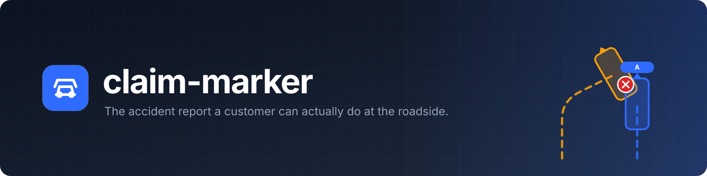
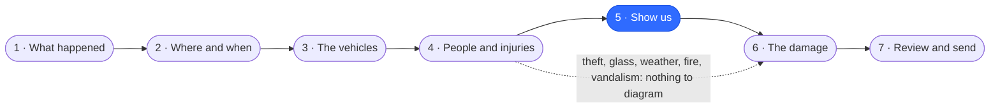
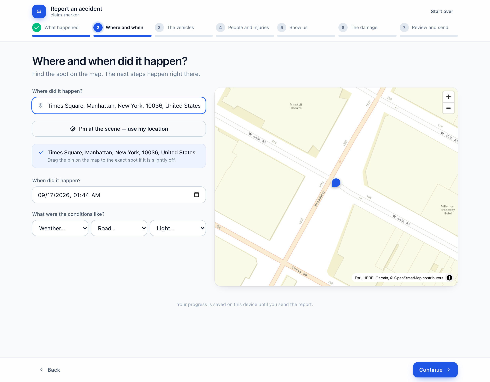
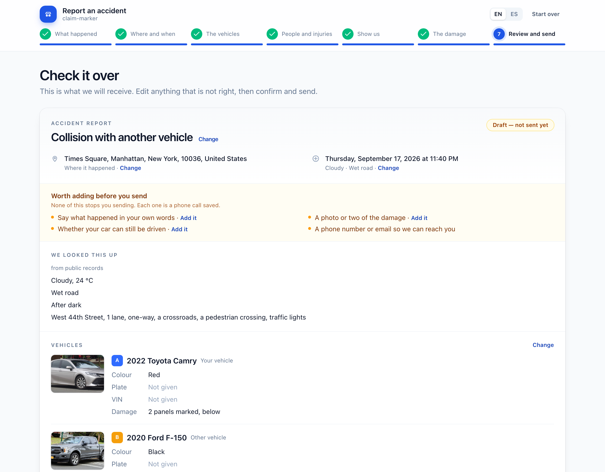
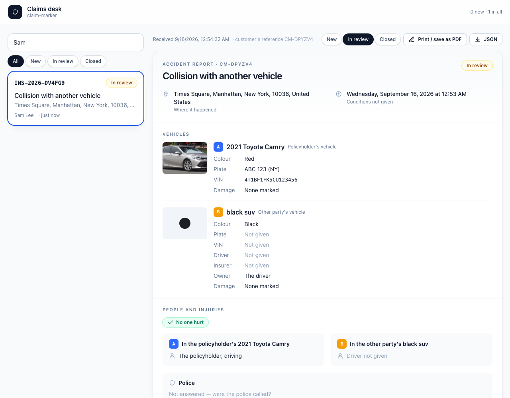

<p align="center">
  
</p>

<p align="center">
  
  
  
  
  
  
</p>

<p align="center">
  <a href="#-the-flow">The flow</a> ·
  <a href="#-what-makes-it-different">What makes it different</a> ·
  <a href="#-quick-start">Quick start</a> ·
  <a href="#-add-it-to-your-site">Add it to your site</a> ·
  <a href="#-the-claims-desk">The claims desk</a> ·
  <a href="#-what-the-insurer-receives">The document</a> ·
  <a href="docs/integration.md">Integration guide</a>
</p>

<br>

The page a customer lands on after tapping **“Tell us what happened”** on their insurer's site. Instead of two flat icons on a clip-art junction and a grid of damage checkboxes: a real map of where it happened, the cars they choose standing on it in 3D, and the damage marked on their own car. Seven steps, one screen each, built to be finished on a phone at the roadside.

<p align="center">
  
  <br>
  <sub><b>Show us</b> — drag each car along the route it took; the point of impact and the panels each car was hit on work themselves out</sub>
</p>

<br>

## 🧭 The flow



<table>
  <tr>
    <td width="50%"></td>
    <td width="50%"></td>
  </tr>
  <tr>
    <td align="center"><sub><b>What happened</b> — the kind decides which questions follow</sub></td>
    <td align="center"><sub><b>The vehicles</b> — make, model and year, a photo of the real car, or just the VIN</sub></td>
  </tr>
  <tr>
    <td></td>
    <td></td>
  </tr>
  <tr>
    <td align="center"><sub><b>People and injuries</b> — who was driving, who was hurt, the police</sub></td>
    <td align="center"><sub><b>The damage</b> — tap the 3D car, say how bad, add photos</sub></td>
  </tr>
  <tr>
    <td></td>
    <td></td>
  </tr>
  <tr>
    <td align="center"><sub><b>Where and when</b> — search, use your location, or tap the map</sub></td>
    <td align="center"><sub><b>Review and send</b> — the report as the insurer reads it, gaps pointed out, signed</sub></td>
  </tr>
</table>

<br>

## ✨ What makes it different

<table>
  <tr>
    <td width="33%" valign="top">
      🧭 <b>The map is the form</b><br>
      <sub>Dragging a car <i>is</i> the input: it moves, draws its path behind it and turns to face the way it went. Two cars touch and the point of impact appears.</sub>
    </td>
    <td width="33%" valign="top">
      🚗 <b>Real cars</b><br>
      <sub>Seven body shapes in thirteen paints at true dimensions, as a three.js layer inside MapLibre. Pick a make and model and the card shows a photograph of that car.</sub>
    </td>
    <td width="33%" valign="top">
      🎯 <b>Damage that works itself out</b><br>
      <sub>From the impact and the way each car faced, the hit panel is already marked when the customer reaches the damage step. Their own marks are never touched.</sub>
    </td>
  </tr>
  <tr>
    <td valign="top">
      ▶️ <b>Play it back</b><br>
      <sub>The cars drive their routes and arrive together at the moment of impact, on the diagram and again on the review page the insurer reads.</sub>
    </td>
    <td valign="top">
      📱 <b>Built for the roadside</b><br>
      <sub>Type the VIN from the insurance card and the car fills itself in. Say what happened instead of typing it. Photos straight from the camera. Progress kept on the device. No account.</sub>
    </td>
    <td valign="top">
      🤖 <b>AI is optional, never in the page</b><br>
      <sub>With an endpoint set, a sentence in the customer's words draws the diagram and the diagram writes the statement. The key stays on the insurer's server; nothing it writes touches fault.</sub>
    </td>
  </tr>
</table>

<br>

## ⚡ Quick start

```bash
npm install
npm run dev      # http://localhost:5173
npm run build    # static site in dist/
```

Or the whole product — the page, the claims desk and the API that receives what the page
sends — on one port:

```bash
docker compose up --build            # http://localhost:8788
```

> [!TIP]
> Built, it installs itself: the page, the seven car bodies, the environment map and the map
> library go on the device, so a customer standing in a basement car park with no signal can
> still fill the whole thing in — and the report leaves by itself when the signal returns.

> [!TIP]
> It works out of the box with **no keys**: Esri for streets and satellite, Photon for addresses, the NHTSA vehicle database for makes, models and VINs, Wikimedia Commons for the photo of the car. A garage or a covered car park, which no map can see, is drawn on a parking lot or a blank sheet instead.

<br>

## 🔌 Add it to your site

One script on the page your customer is logged in to. The report runs in an iframe, sized to
fit, with a token and what you already know about them handed over at runtime:

```html
<div id="report"></div>
<script src="https://claims.example.com/embed.js"></script>
<script>
  ClaimMarker.mount('#report', {
    url: 'https://claims.example.com/',
    submitUrl: 'https://api.example.com/claims',
    token: session.claimToken,
    brand: 'Acme Mutual',
    prefill: { reporter: { name, phone, email, policy }, vehicles: policy.vehicles },
    onSubmitted: (e) => (location.href = '/claims/' + e.reference),
  })
</script>
```

Your backend gets one `POST` of `claim/1` JSON with the token as a bearer and an idempotency
key, and answers with its own claim number. If the phone has no signal the report waits on
the device and sends itself when the signal returns. `server/claim-server.mjs` is a complete
receiving end in one dependency-free file: it validates, files the document with the images
unpacked, dedupes resends, and announces each report with an HMAC-signed webhook.

> [!NOTE]
> The whole contract — embed options, events, the request and response, retries, the webhook
> and how to verify its signature — is in [docs/integration.md](docs/integration.md), and
> `node scripts/integration-smoke.mjs` proves every part of it end to end.

<br>

## 🗂️ The claims desk

<p align="center">
  
</p>

The insurer's side, in the same build at `/adjuster.html`: what has arrived, and each report as
the document it was sent as — the map with playback, the marked-up car, the photographs —
printable to PDF, with a status the desk moves along. A claims system with its own inbox
renders the same `ReportDocument` from wherever it keeps the JSON.

<br>

## 🔧 Configuration

Build-time defaults, as `VITE_*` variables in `.env`; the first four can also arrive at
runtime from the host page (see above).

<details>
<summary><b>The variables</b></summary>
<br>

| variable | what |
| --- | --- |
| `VITE_SUBMIT_URL` | where the finished document is `POST`ed. Unset, the page behaves as if it had sent it. |
| `VITE_BRAND` | the insurer's name under the page title |
| `VITE_FRAUD_NOTICE` | the state-mandated fraud notice above the signature |
| `VITE_ASSIST_URL` | an endpoint speaking `claim-assist/1`; `scripts/assist-server.mjs` is a working one. Unset, no AI exists in the page. |
| `VITE_MAP_TILES_STREETS` · `VITE_MAP_TILES_SATELLITE` | raster tile URL templates for your own map provider |
| `VITE_GEOCODER_URL` | a Photon-compatible geocoder for production volume |
| `VITE_VEHICLE_PHOTO_URL` | a licensed car-image provider, templated on `{make}` `{model}` `{year}` `{color}` |
| `VITE_ALLOWED_HOSTS` | the origins allowed to configure the embedded page, comma-separated. Set it in production. |
| `VITE_CLAIMS_API` | where the claims desk reads reports from (default the reference server on 8788) |

Served by `server/claim-server.mjs`, the last four need no build at all: the server injects
`submitUrl`, `claimsApi`, `brand`, `assistUrl` and `allowedHosts` into the page at startup, so
one built image serves any insurer. Its own environment — tokens, sessions, rate limits, the
CSP — is in [docs/integration.md](docs/integration.md#0-deploy-it).

The page also dispatches `claim:submitted` on `window` with the document as `detail`, for a host page that would rather listen than receive a POST.

</details>

<br>

## 📦 What the insurer receives

One JSON document, `claim/1`: the incident, every vehicle with its damage, the people, the police, the attestation, and as attachments the diagram and the marked-up car as PNGs and the customer's photographs as JPEGs. Positions are `[lng, lat]`, headings are compass bearings, and `export → load → export` is byte-identical. The shape is published as [docs/claim-1.schema.json](docs/claim-1.schema.json), a JSON Schema tested against the parser, and the parser itself ships as `dist/lib/claim.js` for a Node backend.

<details>
<summary><b>An excerpt</b></summary>
<br>

```jsonc
{
  "schema": "claim/1",
  "reference": "CM-7F3K2Q",
  "incident":  { "kind": "collision", "location": { "lng": -73.9859, "lat": 40.7573, "address": "…" }, "description": "…" },
  "vehicles":  [{ "id": "a", "role": "insured", "make": "Honda", "model": "Civic", "year": 2019, "vin": "…",
                  "position": [-73.98592, 40.75731], "heading": 12, "path": [ … ],
                  "damages": [{ "zone": "front_bumper", "severity": "dent", "point": [0.18, 0.32, 1.24] }] }],
  "people":    [{ "role": "passenger", "vehicle": "a", "name": "Sam Lee", "injured": true, "injury": "…" }],
  "impact":    [-73.98588, 40.75736],
  "attachments": { "scene": "data:image/png;base64,…", "damage": { "a": "…" }, "photos": [ … ] }
}
```

</details>

The full shape, and the reasoning behind every design decision, is in [docs/spec-app.md](docs/spec-app.md).

<br>

## 🧪 Development

```bash
npm run lint                         # oxlint, must be silent
npm test                             # vitest, ~240 tests
node scripts/smoke.mjs               # the whole flow in a headless browser, dev server running
node scripts/integration-smoke.mjs   # embed, prefill, offline send, server, webhook, desk
node scripts/shoot.mjs               # regenerate the screenshots above
npm run server                       # the reference claim server, after a build
```

<br>

## 📜 Credits and licence

Source is **MIT** ([LICENSE](LICENSE)). The 3D bodies are Kenney's [Car Kit](https://kenney.nl/assets/car-kit), **CC0**, re-authored at load time so the paint takes the customer's colour ([src/models/LICENSE-ASSETS.md](src/models/LICENSE-ASSETS.md)). Map tiles are Esri's and carry [their terms](https://www.esri.com/en-us/legal/terms/full-master-agreement); addresses are [Photon](https://photon.komoot.io) by komoot; car photographs are Wikimedia Commons, each credited on the card. Nothing here depicts or is endorsed by any real manufacturer or insurer.

<p align="center"><sub>Made for the person standing next to a dented car, wondering what to do next.</sub></p>
