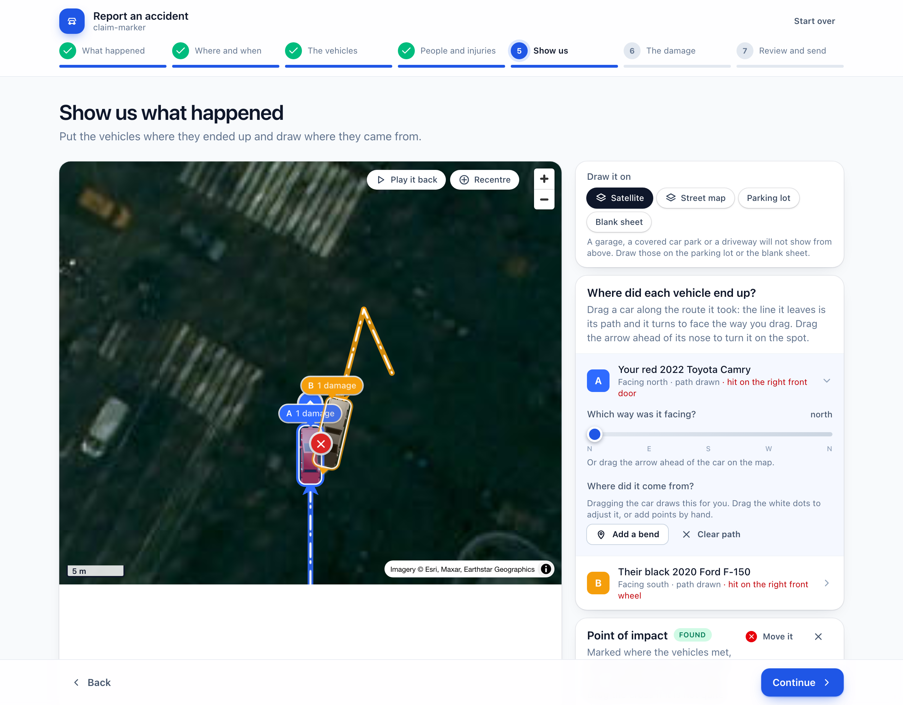
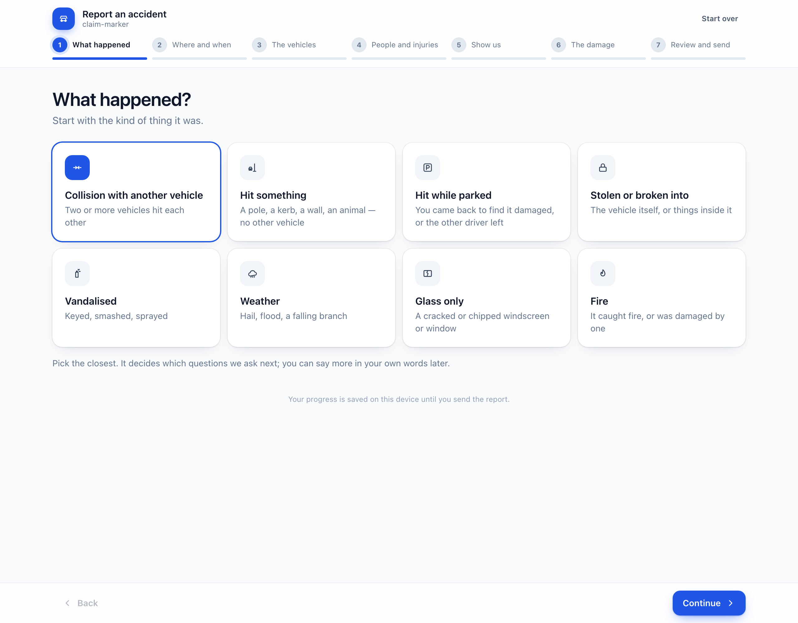
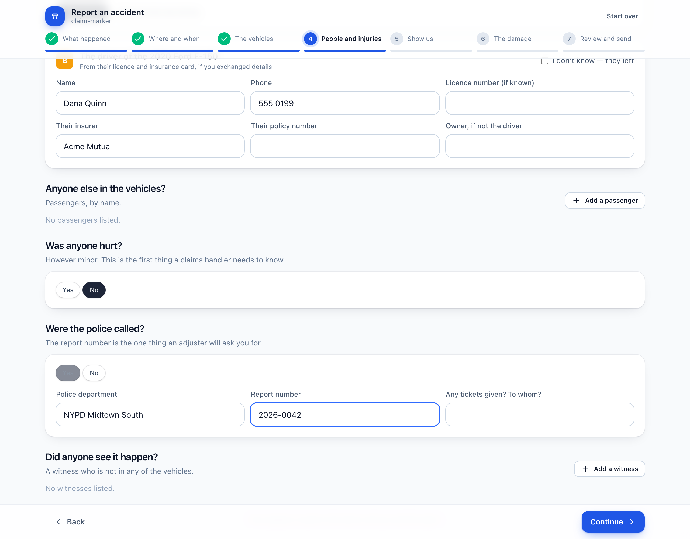
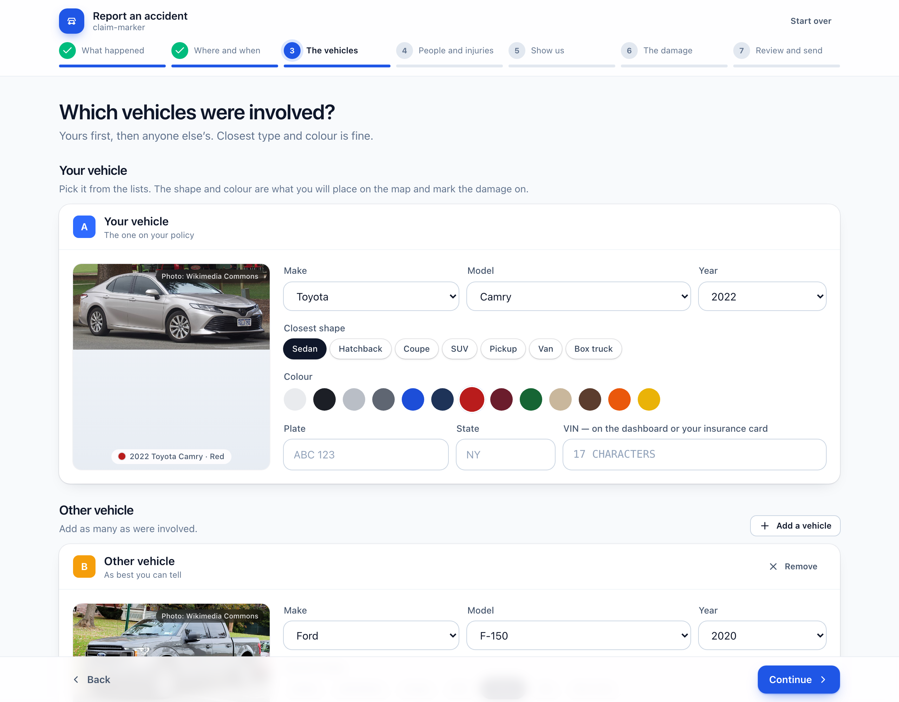
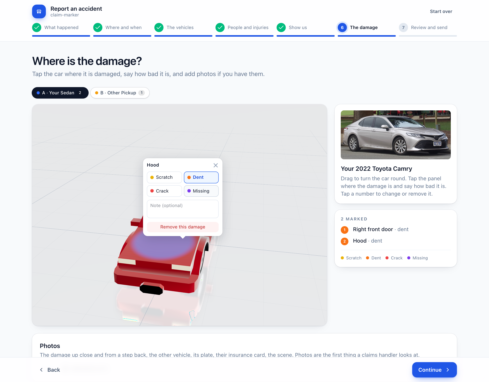

<h1 align="center">claim-marker</h1>

<p align="center">
  The page a customer lands on after clicking <b>“Tell us what happened”</b> on their insurer's site.<br>
  A real map of where it happened, the vehicles they choose standing on it in 3D, the damage marked on their car.
</p>

<p align="center">
  
</p>

<p align="center">
  <sub>React 19 · TypeScript · MapLibre GL · three.js · react-three-fiber · Zustand · Tailwind · MIT</sub>
</p>

---

## What this is

First-notice-of-loss forms still ask *how* with two flat icons on a clip-art junction, and *where the
damage is* with a grid of checkboxes. This replaces the whole step with something a claimant can
actually do on their phone at the roadside:

1. **What happened.** Eight kinds — a collision, hitting something, hit while parked, theft,
   vandalism, weather, glass, fire. This decides which of the next steps are asked at all: a hail
   claim has no other driver and nothing to diagram.
2. **Where and when.** Search an address, or use their location. A map flies there; the pin can be
   dragged to the exact spot. Weather, road and light, if they want to say.
3. **The vehicles.** Their car — make, model and year from the vehicle database, a photograph of
   it, plate, state, VIN — and every other vehicle involved, as many as there were.
4. **People and injuries.** Who was driving, passengers, the other driver and their insurer, who was
   hurt and how, whether the police came and the report number, witnesses.
5. **Show us.** Satellite imagery of that spot with the vehicles standing on it — or, for a garage, a
   covered car park or anywhere a map cannot see, a drawn parking lot or a blank sheet. Drag a car
   along the route it took and it draws its path; drag the handle ahead of its nose to turn it; the
   point of impact appears where two cars meet, and the panel each car was hit on is marked from
   it; play it back. A sentence in their own words — or, with the assistant on, the sentence draws
   the diagram.
6. **The damage.** The 3D car in their colour with the hit panel already marked: tap to add, say
   how bad it is. Photos, downscaled on the phone. Whether it can be driven, whether the airbags
   went off, whether it was towed and where it is now. Anything else that was hit.
7. **Review and send.** One page of what the insurer will receive, who to contact, the fraud
   notice, their name as a signature, then a reference number.

Nothing developer-facing is on screen. What the insurer receives is a versioned JSON document
with the diagram and the marked-up car as PNGs and the customer's photographs as JPEGs in it,
and progress is saved on the device until it is sent.

| | |
| --- | --- |
|  |  |
| **What happened** — the kind decides the questions | **People** — who was there, who was hurt, the police |
|  |  |
| **Vehicles** — the real car, from make, model and year | **Damage** — tap the panel, pick a severity, add photos |

## Quick start

```bash
npm install
npm run dev      # http://localhost:5173
npm run build    # static site in dist/
```

It works out of the box with no keys: Esri for streets and satellite, Photon for address search,
the NHTSA vehicle database for makes and models, Wikimedia Commons for a photograph of the car. See *Configuration* to point it at your own providers and endpoint.

## The assistant (optional)

Two things, both on the "what happened" step, both off unless `VITE_ASSIST_URL` is set:

- **Draw this on the map** — the customer describes the accident in their own words and the
  vehicles place themselves: where each ended up, which way it faced, the route it took, and
  where they hit. Everything stays draggable; it is a first draft of the diagram, not a
  verdict.
- **Write it from the diagram** — the reverse: the diagram they have built becomes the written
  statement, for them to read and correct. Most people describe an accident badly in writing
  and draw it well.

### How an insurer wires it up

**The API key never goes in the page.** Anything in a browser bundle is public, so the page
calls one endpoint the insurer runs, and that endpoint holds the credential:

```
the customer's browser  ──POST claim-assist/1──▶  the insurer's endpoint  ──▶  Claude
                        ◀──────JSON scene───────  (holds the API key)
```

That is the whole integration surface: one route, JSON in and JSON out, versioned. Which
model provider sits behind it is the insurer's business — the Anthropic API, AWS Bedrock, GCP
Vertex for data residency, or an internal LLM gateway with their own logging and redaction.
The page never learns which.

`scripts/assist-server.mjs` is a working implementation of that route, in about 200 lines with
no dependencies. Run it locally:

```bash
ANTHROPIC_API_KEY=sk-ant-… node scripts/assist-server.mjs   # http://localhost:8787
VITE_ASSIST_URL=http://localhost:8787 npm run dev
```

To move it to another provider, replace its `askClaude` function and change nothing else.

The request and response shapes are `src/assist/schema.ts`. Positions in them are **metres
east and north of the incident**, never longitude and latitude: a model reasons well about
"six metres back from the junction" and cannot do spherical arithmetic, so the page converts
at the boundary.

### What the page assumes about the answer

A model's answer is input, not data. `parseScene` drops any vehicle that is malformed, out of
range, or not one the customer already listed, so the assistant can only rearrange vehicles
the customer entered themselves — it cannot invent one. An answer with nothing usable in it
changes nothing. The customer's own words go into the prompt, so this matters: the worst a
crafted description can do is draw a wrong diagram, which they are looking at and can drag.
`scripts/assist-smoke.mjs` proves all of that against a stub endpoint, no key required.

Anything the assistant writes is labelled as written by AI and is the customer's to correct
before it is sent. Nothing in it touches fault.

## Configuration

All optional, all `VITE_*` build-time variables (put them in `.env`):

| variable | what |
| --- | --- |
| `VITE_SUBMIT_URL` | where the finished document is `POST`ed as JSON. Unset, the page behaves as if it had sent it, so the flow can be tried before anything is wired up. |
| `VITE_BRAND` | the insurer's name under the page title |
| `VITE_MAP_TILES_STREETS` | a raster tile URL template for the street map (default Esri World Street Map) |
| `VITE_MAP_TILES_SATELLITE` | a raster tile URL template for satellite imagery (default Esri World Imagery) |
| `VITE_GEOCODER_URL` | a Photon-compatible geocoder (default `https://photon.komoot.io`) |
| `VITE_FRAUD_NOTICE` | the fraud notice shown above the signature; the wording is state-mandated, so set your state's |
| `VITE_ASSIST_URL` | an endpoint that speaks `claim-assist/1` (below). Unset, the page has no AI in it at all and every button is hidden. |
| `VITE_VEHICLE_PHOTO_URL` | a URL template with `{make}`, `{model}`, `{year}` and `{color}` for a licensed car-image provider (studio renders in the customer's colour). Unset, the card shows a Wikimedia Commons photograph of the make and model, credited. |

The page also dispatches `claim:submitted` on `window` with the document as `detail`, so a host
page that embeds this one in an iframe or a route can pick it up without a server.

## The document

`claim/1`. Positions are `[lng, lat]` on the real map, headings are compass bearings in degrees
clockwise from north, and each vehicle's `damages` keep the `claim-marker/1` shape from the
earlier widget so zone ids, hit points and severities mean what they always did.

```json
{
  "schema": "claim/1",
  "reference": "CM-7F3K2Q",
  "submittedAt": "2026-09-07T22:14:03.000Z",
  "reporter": { "name": "Ashish B", "phone": "555 0100", "email": "me@example.com", "policy": "POL-9", "policyholder": true },
  "incident": {
    "kind": "collision",
    "at": "2026-09-06T17:30",
    "location": { "lng": -73.9859, "lat": 40.7573, "address": "Times Square, Manhattan, New York, 10036, United States" },
    "surface": "satellite",
    "conditions": { "weather": "rain", "road": "wet", "light": "dark_lit" },
    "description": "The van pulled out across me."
  },
  "vehicles": [
    {
      "id": "a", "role": "insured", "body": "sedan", "color": "#b91c1c",
      "make": "Honda", "model": "Civic", "year": 2019, "plate": "ABC 123", "plateState": "NY", "vin": "1HGCM82633A004352",
      "owner": "", "insurer": "", "policy": "",
      "condition": { "drivable": false, "airbags": true, "towed": true, "location": "Mike's Towing, Brooklyn" },
      "position": [-73.98592, 40.75731], "heading": 12,
      "path": [[-73.98601, 40.75712]],
      "damages": [{ "zone": "front_bumper", "point": [0.18, 0.32, 1.24], "severity": "dent", "note": "" }]
    },
    { "id": "b", "role": "other", "body": "van", "color": "#e9ebee", "make": "", "model": "", "year": null, "plate": "", "plateState": "", "vin": "",
      "owner": "", "insurer": "Acme Mutual", "policy": "AM-77",
      "condition": { "drivable": null, "airbags": null, "towed": null, "location": "" },
      "position": [-73.98575, 40.75738], "heading": 262, "path": [[-73.98553, 40.75742]], "damages": [] }
  ],
  "people": [
    { "role": "driver", "vehicle": "b", "self": false, "name": "Dana Q", "phone": "555 0199", "licence": "D1234", "injured": false, "injury": "" },
    { "role": "passenger", "vehicle": "a", "self": false, "name": "Sam Lee", "phone": "", "licence": "", "injured": true, "injury": "Whiplash, seen at urgent care" },
    { "role": "witness", "vehicle": null, "self": false, "name": "Wit Ness", "phone": "555 0111", "licence": "", "injured": false, "injury": "" }
  ],
  "impact": [-73.98588, 40.75736],
  "police": { "called": true, "department": "NYPD Midtown South", "report": "2026-0042", "citations": "" },
  "property": { "description": "Traffic light pole", "owner": "City of New York" },
  "attestation": { "agreed": true, "name": "Ashish B", "at": "2026-09-07T22:14:03.000Z" },
  "attachments": {
    "scene": "data:image/png;base64,…",
    "damage": { "a": "data:image/png;base64,…" },
    "photos": [{ "data": "data:image/jpeg;base64,…", "of": "a", "caption": "Front bumper, close up" }]
  }
}
```

Coordinates round to six decimals and headings to a degree, so `export → load → export` is
byte-identical; that round trip is a test. `parseClaim` throws on the wrong object and drops a
malformed vehicle rather than losing the rest.

`point` is where the tap landed in the vehicle's own frame: nose at +Z, up +Y, **the car's left
at +X** — left and right as seen from the driver's seat.

### Vehicles and zones

Seven bodies from Kenney's Car Kit (CC0): `sedan` `hatchback` `coupe` `suv` `truck` (pickup)
`van` `box_truck`. Their flat colour maps are re-authored at load time — the paint becomes a
clearcoat material in the customer's colour, the trim keeps its texture — which is why the same
model can be any of thirteen paints.

**Zone sets differ per body.** A coupe has no rear doors; a van's rear flank is a `cargo_side`,
not a quarter panel; a box truck has a `cargo_roof` and a `cargo_door` and no rear window. Each
anchor is placed against measurements of its own mesh (`scripts/profile-body.mjs`), a test keeps
anchors apart, and `scripts/probe-zones.ts` samples every triangle to prove each zone can be
reached. A damage is validated against its own body's zone set on load.

Severities are `scratch` · `dent` · `crack` · `missing`, fixed.

## Maps and attribution

- **Streets:** Esri World Street Map tiles. Attribution is shown on the map.
- **Drawn grounds:** the parking lot and the blank sheet are generated on the page; nothing to credit.
- **Satellite:** Esri World Imagery tiles. Attribution is shown on the map; check
  [Esri's terms](https://www.esri.com/en-us/legal/terms/full-master-agreement) for your use.
- **Search:** [Photon](https://photon.komoot.io) by komoot. A public instance with a fair-use
  policy; run your own or set `VITE_GEOCODER_URL` for production volume.
- **Car photographs:** Wikimedia Commons, via Wikipedia's page-image API. Each photo is under
  its own free licence and is credited on the card with a link to the file; a licensed
  studio-image provider goes in `VITE_VEHICLE_PHOTO_URL` for production.

The vehicles are drawn by three.js inside MapLibre as a custom layer, positioned relative to a
floating origin at the incident so they hold still at street zoom, and everything a finger grabs
is a MapLibre marker. Why is in [docs/spec-app.md](docs/spec-app.md).

## Development

```bash
npm run lint       # oxlint, must be silent
npm test           # vitest: geography, the document, the map transform, zones, the marker camera
npm run build
```

With the dev server running:

```bash
node scripts/smoke.mjs      # the whole flow headlessly: search, vehicles, drag on the map, damage, send
node scripts/shoot.mjs      # regenerate docs/*.png and assert the attachments are real frames
node scripts/probe-zones.ts # every zone on every body claims some bodywork
node scripts/profile-body.mjs src/models/van.glb   # the measurements anchors are placed against
```

Design decisions, including the ones not visible in the code, are in
[docs/spec-app.md](docs/spec-app.md). The earlier widget era is documented in
[docs/spec.md](docs/spec.md), [docs/spec-scenario.md](docs/spec-scenario.md) and
[docs/spec-polish.md](docs/spec-polish.md), and lives in git history.

## Licence

Source is **MIT** (see [LICENSE](LICENSE)). The 3D models are from Kenney's
[Car Kit](https://kenney.nl/assets/car-kit), **CC0**; details and the changes made are in
[src/models/LICENSE-ASSETS.md](src/models/LICENSE-ASSETS.md). Map data and imagery carry their
providers' terms, above. Nothing here depicts or is endorsed by any real manufacturer or insurer.
