<p align="center">
  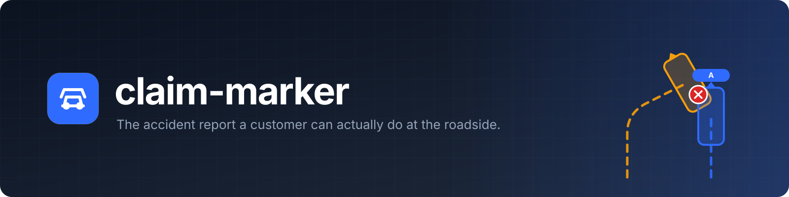
</p>

<p align="center">
  
  
  
  
  
  
</p>

<p align="center">
  <a href="#-try-it">Try it</a> ·
  <a href="#-the-flow">The flow</a> ·
  <a href="#-watch-it-back">Watch it back</a> ·
  <a href="#-what-makes-it-different">What makes it different</a> ·
  <a href="#-quick-start">Quick start</a> ·
  <a href="#-add-it-to-your-site">Add it to your site</a> ·
  <a href="#-the-claims-desk">The claims desk</a> ·
  <a href="#-what-the-insurer-receives">The document</a> ·
  <a href="docs/integration.md">Integration guide</a>
</p>

<!-- TODO(live URL): once `fly deploy` has run, point this at https://<app>.fly.dev/demo/ -->
<p align="center">
  <a href="docs/integration.md#deploy-to-fly">
    
  </a>
</p>

<br>

The page a customer lands on after tapping **“Tell us what happened”** on their insurer's site. Instead of two flat icons on a clip-art junction and a grid of damage checkboxes: a real map of where it happened, the cars they choose standing on it in 3D, and the damage marked on their own car. Seven steps, one screen each, built to be finished on a phone at the roadside.

<p align="center">
  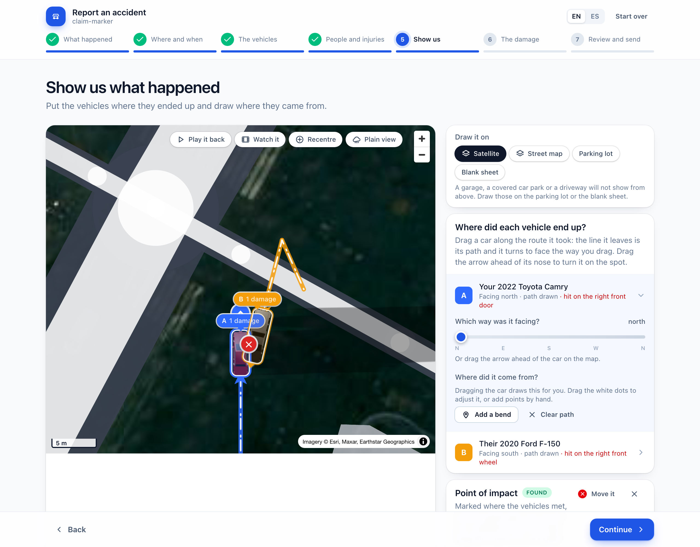
  <br>
  <sub><b>Show us</b> — drag each car along the route it took; the point of impact and the panels each car was hit on work themselves out</sub>
</p>

<br>

## 🧭 The flow

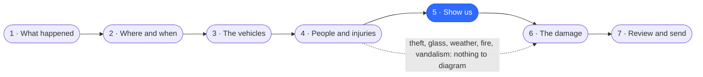
```mermaid
flowchart LR
  A(["1 · What happened"]) --> B(["2 · Where and when"]) --> C(["3 · The vehicles"]) --> D(["4 · People and injuries"])
  D --> E(["5 · Show us"]) --> F(["6 · The damage"]) --> G(["7 · Review and send"])
  D -. "theft, glass, weather, fire, vandalism: nothing to diagram" .-> F
  style E fill:#2f6bff,stroke:#1f56e6,color:#fff
```

<table>
  <tr>
    <td width="50%">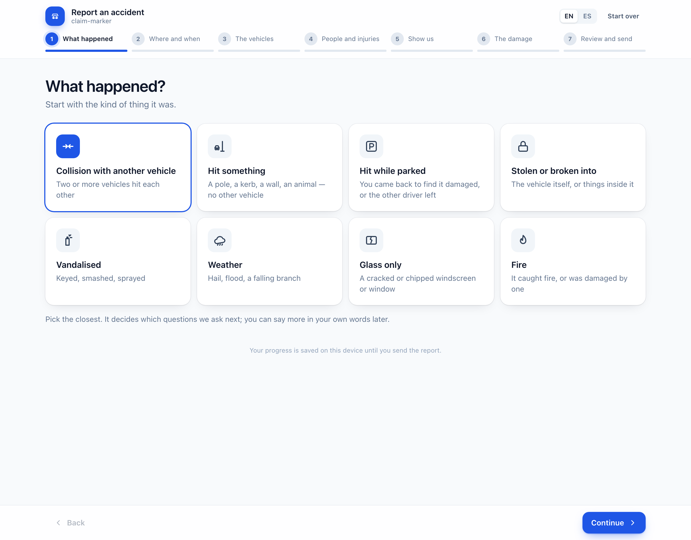</td>
    <td width="50%">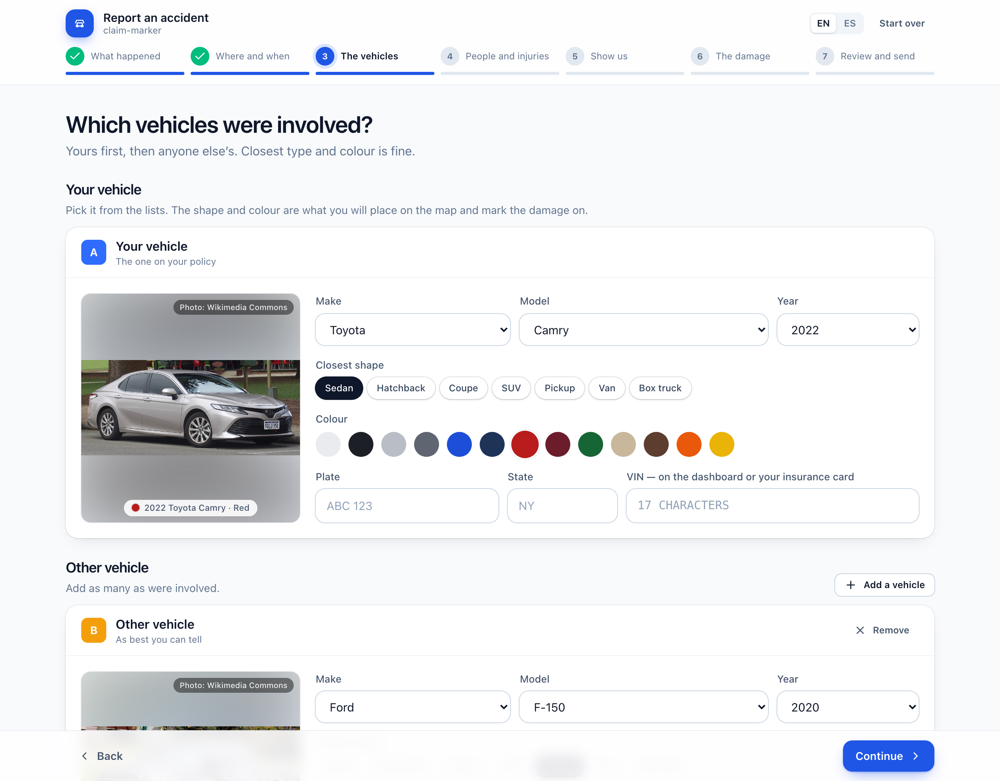</td>
  </tr>
  <tr>
    <td align="center"><sub><b>What happened</b> — the kind decides which questions follow</sub></td>
    <td align="center"><sub><b>The vehicles</b> — make, model and year, a photo of the real car, or just the VIN</sub></td>
  </tr>
  <tr>
    <td>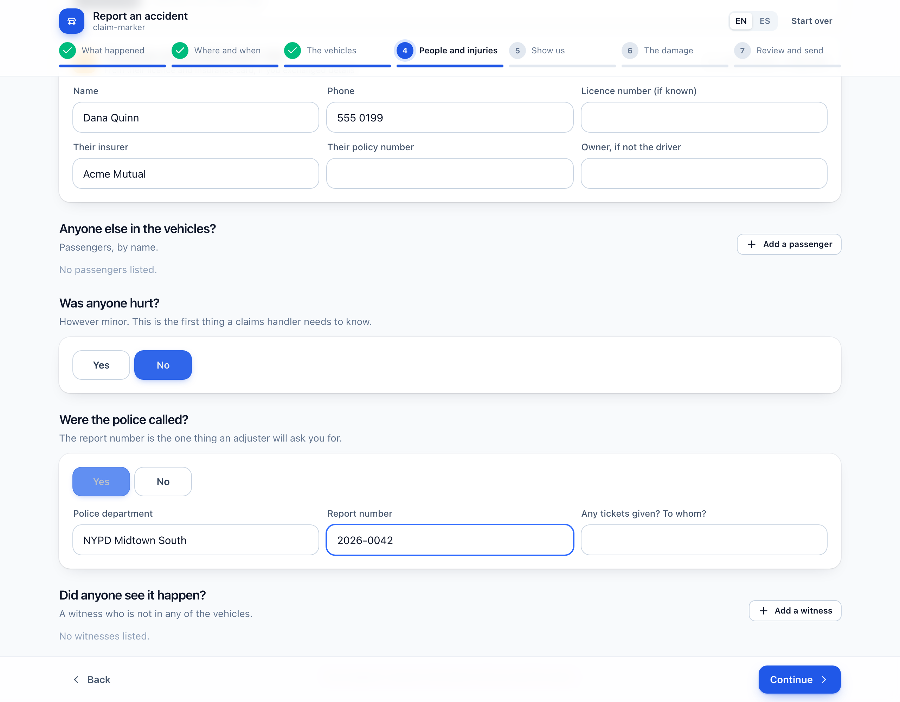</td>
    <td>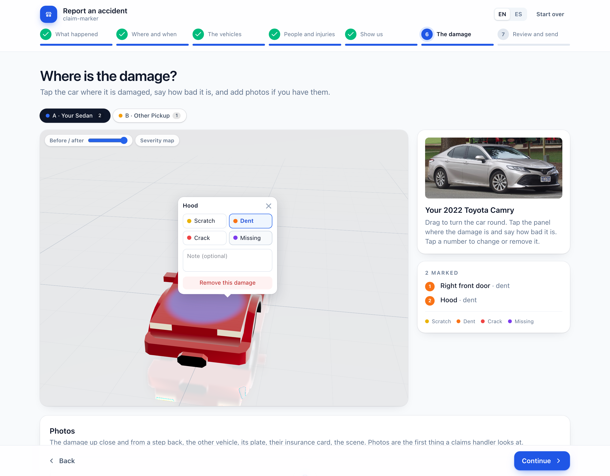</td>
  </tr>
  <tr>
    <td align="center"><sub><b>People and injuries</b> — who was driving, who was hurt, the police</sub></td>
    <td align="center"><sub><b>The damage</b> — tap the 3D car, say how bad, add photos</sub></td>
  </tr>
  <tr>
    <td>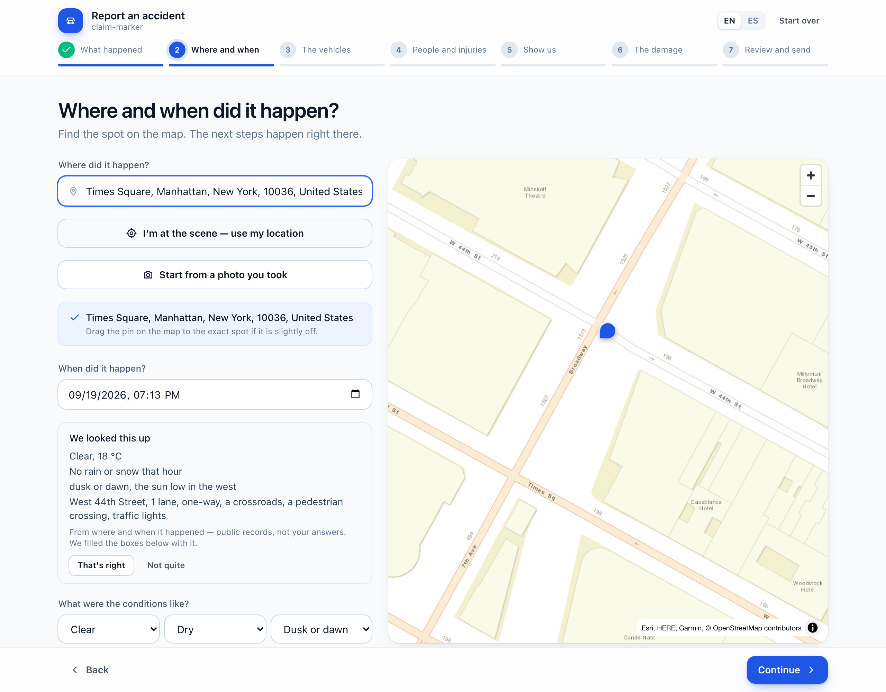</td>
    <td>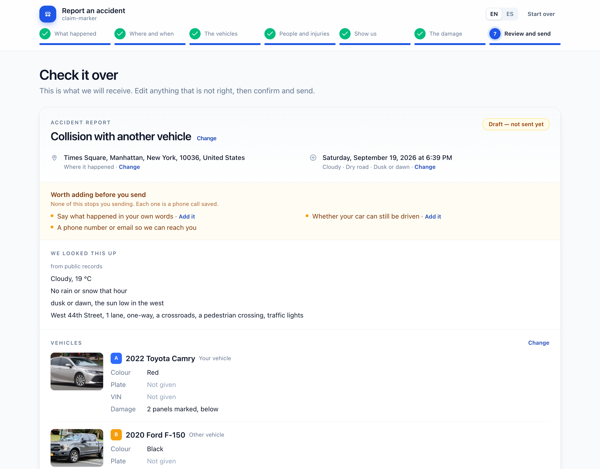</td>
  </tr>
  <tr>
    <td align="center"><sub><b>Where and when</b> — search, use your location, or tap the map</sub></td>
    <td align="center"><sub><b>Review and send</b> — the report as the insurer reads it, gaps pointed out, signed</sub></td>
  </tr>
</table>

<p align="center">
  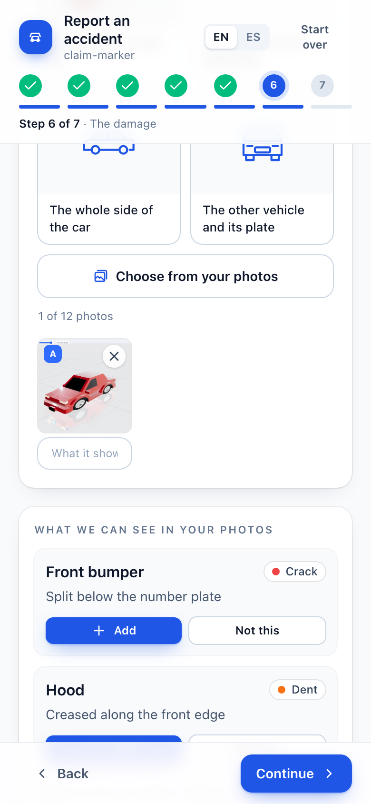
</p>
<p align="center"><sub><b>On a phone, with the assistant on</b> — the camera comes first, the panels it read come back to confirm, and the 3D car is there for whatever they missed</sub></p>

<br>

## 🎥 Watch it back

The same routes the customer drew, with the camera let off the leash: it holds the overhead, tilts
behind their car, follows it, eases into the impact at a quarter of the rate, rings it with a
shockwave, and comes back to the flat diagram exactly as they left it. Nothing in the document
changes. The clip is recorded once at send time and rides along with the report, so an adjuster
watches what happened instead of reading coordinates.

<table>
  <tr>
    <td width="50%">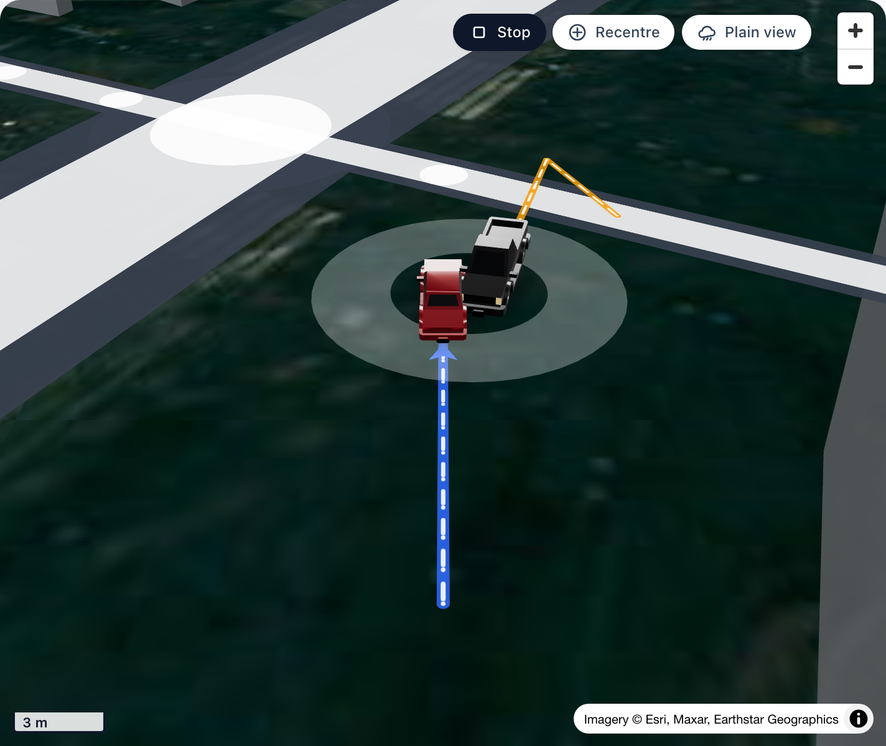</td>
    <td width="50%">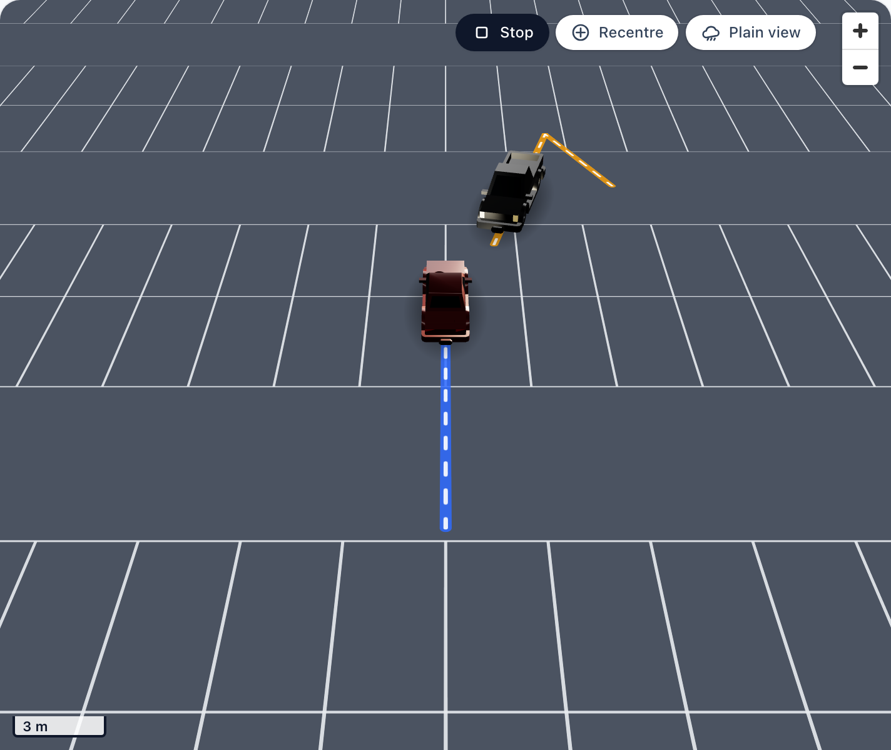</td>
  </tr>
  <tr>
    <td align="center"><sub><b>Watch it</b> — the map tilts to 55°, the blocks around the junction stand up from the same public map the road came from, and the shockwave spreads from where the two cars met</sub></td>
    <td align="center"><sub><b>Lit as it was</b> — the same accident at half past nine at night, drawn on the parking-lot ground a covered car park gets. The paint goes dark, the headlights come on and each car throws its own pool of light; the only thing changed is the hour in the record</sub></td>
  </tr>
</table>

<br>

## ✨ What makes it different

<table>
  <tr>
    <td width="33%" valign="top">
      🧭 <b>The map is the form</b><br>
      <sub>Dragging a car <i>is</i> the input: it moves, draws its path behind it and turns to face the way it went. Two cars touch and the point of impact appears.</sub>
    </td>
    <td width="33%" valign="top">
      🚗 <b>Real cars</b><br>
      <sub>Seven body shapes in thirteen paints at true dimensions, as a three.js layer inside MapLibre. Pick a make and model and the card shows a photograph of that car.</sub>
    </td>
    <td width="33%" valign="top">
      🎯 <b>Damage that works itself out</b><br>
      <sub>From the impact and the way each car faced, the hit panel is already marked when the customer reaches the damage step. Their own marks are never touched.</sub>
    </td>
  </tr>
  <tr>
    <td valign="top">
      🩹 <b>The paint shows it</b><br>
      <sub>A dent is a dish in the bodywork, a scratch bares the metal, a crack spreads across the glass, a missing part is a hole into the dark — drawn by a shader on the car itself, with a strength slider and a severity map over it.</sub>
    </td>
    <td valign="top">
      🌗 <b>Lit by the hour it happened</b><br>
      <sub>The sun where the record puts it, real shadows that lengthen into the evening, a wet road when it rained, snow, fog, headlights after dark. Decoration keyed off stored facts: nothing in it moves a car or a mark.</sub>
    </td>
    <td valign="top">
      🏙️ <b>The street it happened on</b><br>
      <sub>The road, its lanes and its junction come back from OpenStreetMap as words in the report — and the blocks around it as footprints on the diagram, standing up into a city while the replay flies through them.</sub>
    </td>
  </tr>
  <tr>
    <td valign="top">
      📸 <b>Photographs that know their panel</b><br>
      <sub>Drag a photo onto the car and it stands beside that panel as a card you can tap. Its own EXIF says how far from the scene and how long after it was taken — and only those two distances are kept, never the position.</sub>
    </td>
    <td valign="top">
      👥 <b>Both drivers, one accident</b><br>
      <sub>A QR code at the scene invites the other driver to give their own account on their own phone — no app, no account, and never a look at the first report. The desk gets both, on one clock.</sub>
    </td>
    <td valign="top">
      📱 <b>Built for the roadside</b><br>
      <sub>Type the VIN from the insurance card and the car fills itself in. Say what happened instead of typing it. Photos straight from the camera. Progress kept on the device. No account.</sub>
    </td>
  </tr>
  <tr>
    <td colspan="3" valign="top">
      🤖 <b>AI is optional, and never in the page</b><br>
      <sub>With an endpoint set, a sentence in the customer's words draws the diagram, the diagram writes the statement, and photographs come back as marked panels. The key stays on the insurer's server; what comes back is treated as untrusted input, and nothing it writes says whose accident it was.</sub>
    </td>
  </tr>
</table>

<br>

<table>
  <tr>
    <td width="50%">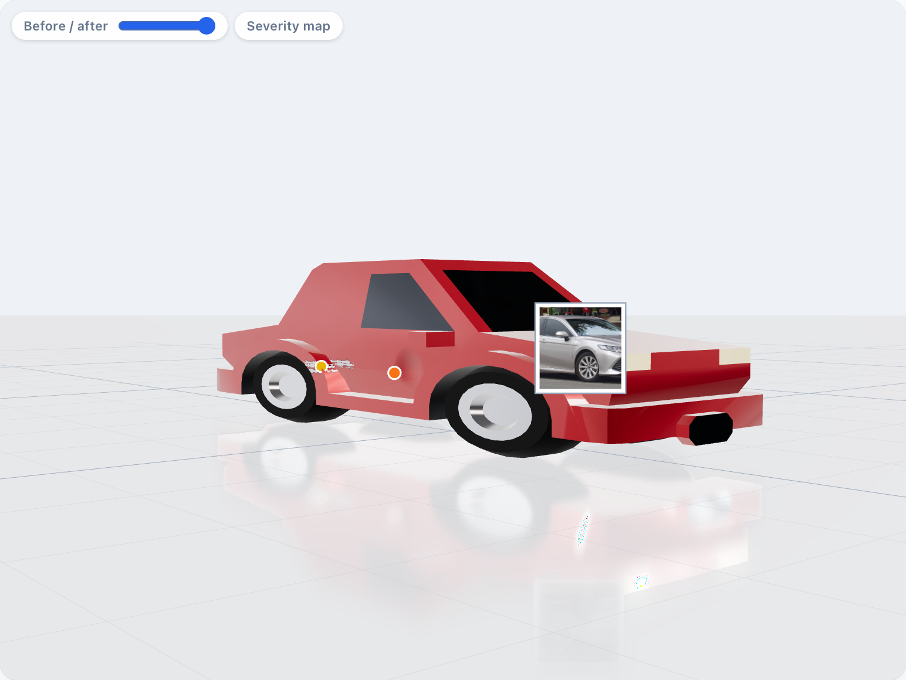</td>
    <td width="50%">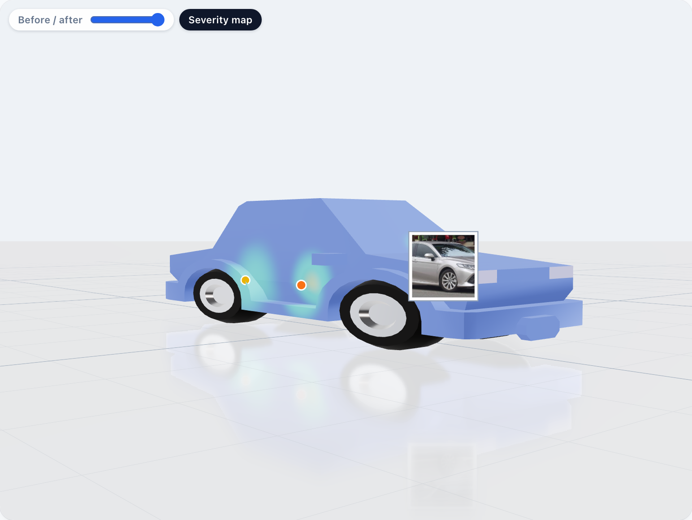</td>
  </tr>
  <tr>
    <td align="center"><sub><b>In the paint, not over it</b> — a dent dishes the panel, a scratch bares the metal under it, and each photograph stands beside the panel it shows. <i>Before / after</i> runs the car back to how it was</sub></td>
    <td align="center"><sub><b>The severity map</b> — the paint swapped for what each panel is carrying, so a whole side reads at a glance. A dent in bright paint is quiet by design; this is the view that is not</sub></td>
  </tr>
</table>

<br>

## 🎬 Try it

<p align="center">
  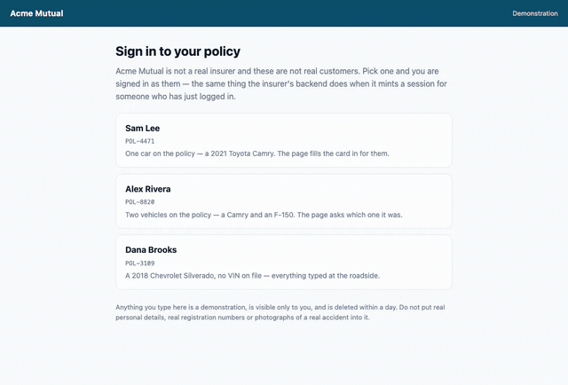
  <br>
  <sub><b>The demo portal</b> — sign in as a sample customer of "Acme Mutual", report the accident in the page embedded on their policy screen, get a claim number, then open the desk the report landed on</sub>
</p>

`server/demo/` is an insurer's portal in a few hundred lines of plain HTML — deliberately a
different stack from the React page it embeds. The claim server serves it at `/demo/` when it
is started with `DEMO=1`:

```bash
npm run build
SESSION_SECRET=$(openssl rand -hex 32) DESK_TOKEN=desk-token DEMO=1 BRAND='Acme Mutual' \
node server/claim-server.mjs         # http://localhost:8788/demo/
```

Reports filed through it are deleted within a day, and a visitor's own session opens the report
they filed and nobody else's. `node scripts/record-demo.mjs` records the GIF above.

<br>

## ⚡ Quick start

> **Live instance: TODO** — there is no public URL yet. Deploying it is six commands and an
> account: [Deploy to Fly](docs/integration.md#deploy-to-fly). Replace this line with the link
> once `fly deploy` has run.

```bash
npm install
npm run dev      # http://localhost:5173
npm run build    # static site in dist/
```

Or the whole product — the page, the claims desk and the API that receives what the page
sends — on one port:

```bash
docker compose up --build            # http://localhost:8788
```

Public hosting is `fly.toml` (or `render.yaml`): the same image, a volume for the reports, TLS,
and `RETAIN_DAYS` so a public instance forgets strangers' photographs — see
[Deploy to Fly](docs/integration.md#deploy-to-fly).

> [!TIP]
> Built, it installs itself: the page, the seven car bodies, the environment map and the map
> library go on the device, so a customer standing in a basement car park with no signal can
> still fill the whole thing in — and the report leaves by itself when the signal returns.

> [!TIP]
> It works out of the box with **no keys**: Esri for streets and satellite, Photon for addresses, the NHTSA vehicle database for makes, models and VINs, Wikimedia Commons for the photo of the car, Open-Meteo for the weather at that hour and Overpass for the road and the buildings around it. A garage or a covered car park, which no map can see, is drawn on a parking lot or a blank sheet instead.

<br>

## 🔌 Add it to your site

One script on the page your customer is logged in to. The report runs in an iframe, sized to
fit, with a token and what you already know about them handed over at runtime:

```html
<div id="report"></div>
<script src="https://claims.example.com/embed.js"></script>
<script>
  ClaimMarker.mount('#report', {
    url: 'https://claims.example.com/',
    submitUrl: 'https://api.example.com/claims',
    token: session.claimToken,
    brand: 'Acme Mutual',
    prefill: { reporter: { name, phone, email, policy }, vehicles: policy.vehicles },
    onSubmitted: (e) => (location.href = '/claims/' + e.reference),
  })
</script>
```

Your backend gets one `POST` of `claim/1` JSON with the token as a bearer and an idempotency
key, and answers with its own claim number. If the phone has no signal the report waits on
the device and sends itself when the signal returns. `server/claim-server.mjs` is a complete
receiving end in one dependency-free file: it validates, files the document with the images
and the replay unpacked, dedupes resends, mints the party links that bring the other driver
in, and announces each report with an HMAC-signed webhook.

> [!NOTE]
> The whole contract — embed options, events, the request and response, retries, the party
> invite, the webhook and how to verify its signature — is in
> [docs/integration.md](docs/integration.md), and `node scripts/integration-smoke.mjs` proves
> every part of it end to end.

<br>

## 🗂️ The claims desk

<p align="center">
  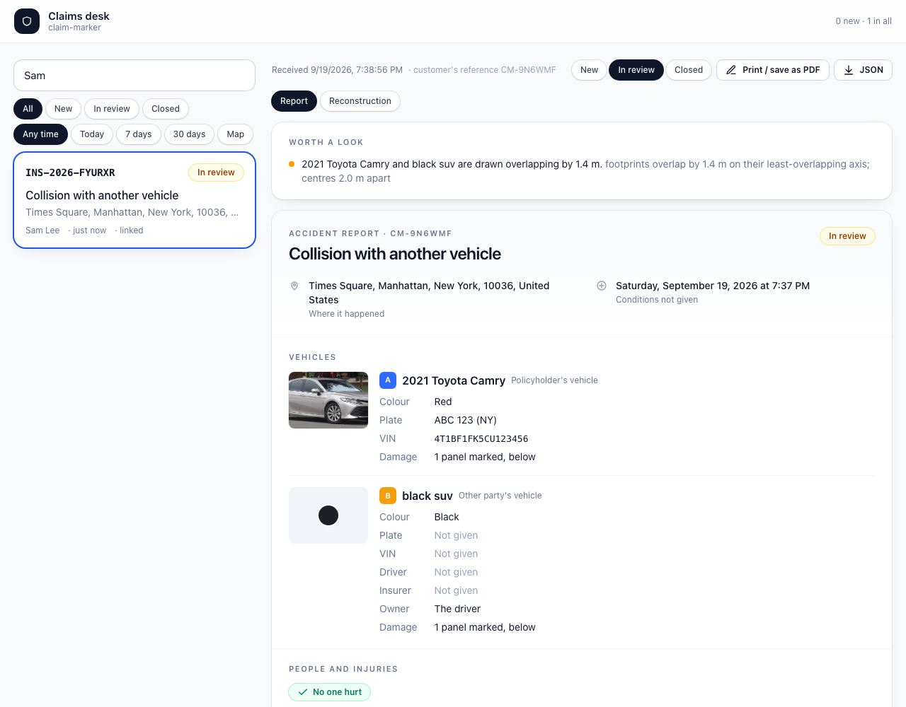
</p>

The insurer's side, in the same build at `/adjuster.html`: what has arrived, and each report as
the document it was sent as — the map with playback, the marked-up car, the photographs —
printable to PDF, with a status the desk moves along. A claims system with its own inbox
renders the same `ReportDocument` from wherever it keeps the JSON.

Three things sit beside that list, and none of them is an opinion about a report:

<table>
  <tr>
    <td width="50%">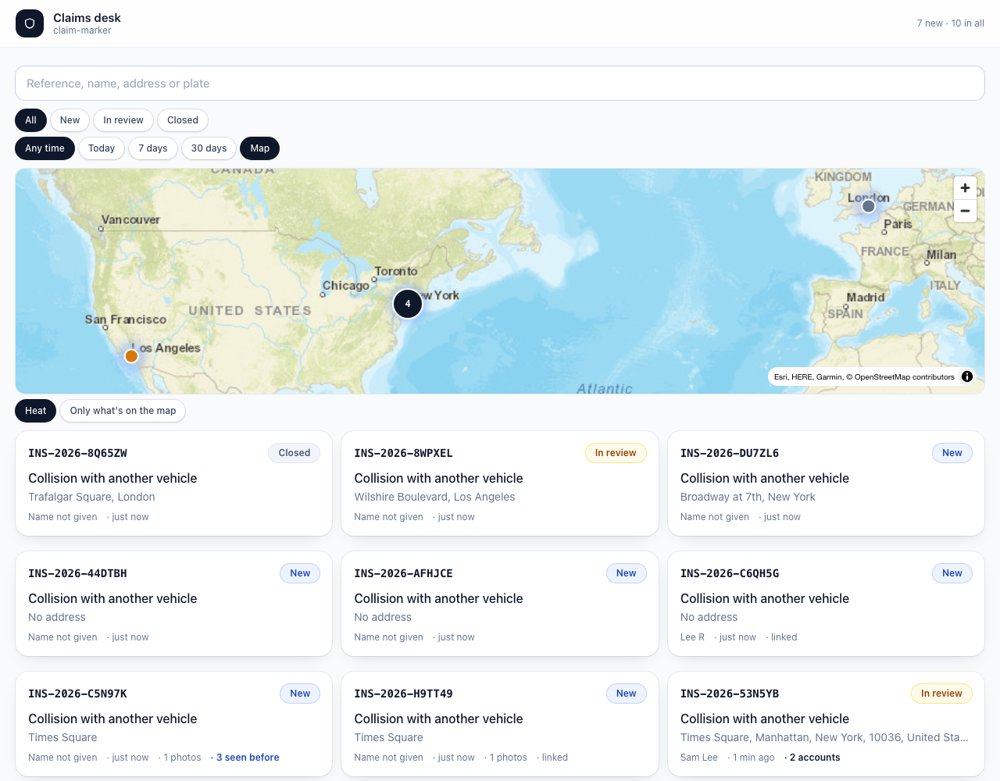</td>
    <td width="50%">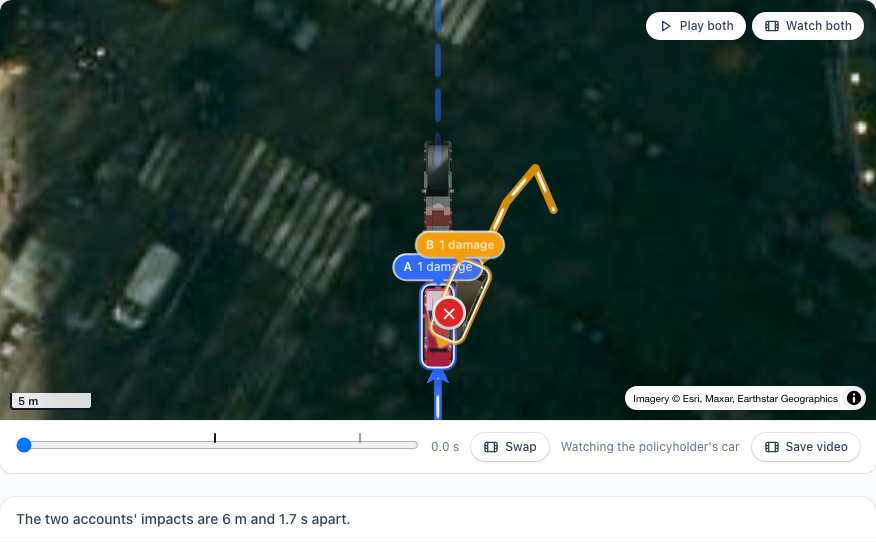</td>
  </tr>
  <tr>
    <td align="center"><sub><b>The map of everything</b> — a pin per report in the colour of its status, clustered as it zooms out, with a heat layer for volume and “only what's on the map” to make the list follow the view</sub></td>
    <td align="center"><sub><b>Two accounts, one clock</b> — both drivers' cars on one scrubber with an impact tick each, “Swap” to ride with the other one, and a video of the pair to save. It says how far apart the two accounts are and nothing about who is right</sub></td>
  </tr>
  <tr>
    <td colspan="2" align="center">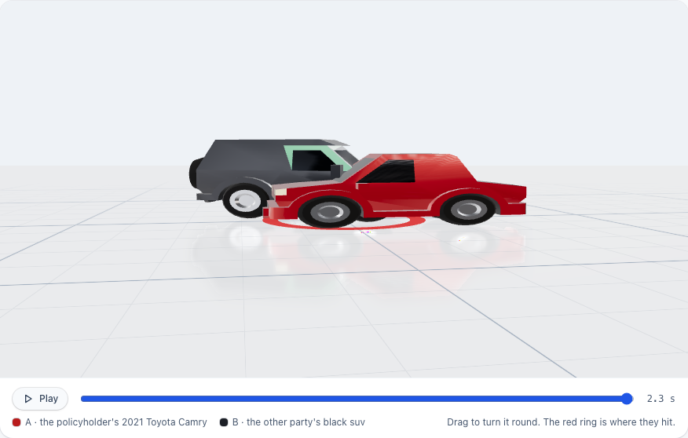</td>
  </tr>
  <tr>
    <td colspan="2" align="center"><sub><b>The reconstruction</b> — a tab beside the report: every car on the diagram stood where the map put it, in its own paint and with its own damage, to walk round and play through. Held here at the moment the two are nearest. A small copy of it sits under the map on the customer's own review page</sub></td>
  </tr>
</table>

<br>

## 🔧 Configuration

Build-time defaults, as `VITE_*` variables in `.env`; the first four can also arrive at
runtime from the host page (see above).

<details>
<summary><b>The variables</b></summary>
<br>

| variable | what |
| --- | --- |
| `VITE_SUBMIT_URL` | where the finished document is `POST`ed. Unset, the page behaves as if it had sent it. |
| `VITE_BRAND` | the insurer's name under the page title |
| `VITE_FRAUD_NOTICE` | the state-mandated fraud notice above the signature |
| `VITE_ASSIST_URL` | an endpoint speaking `claim-assist/1`; `scripts/assist-server.mjs` is a working one. Unset, no AI exists in the page. |
| `VITE_MAP_TILES_STREETS` · `VITE_MAP_TILES_SATELLITE` | raster tile URL templates for your own map provider |
| `VITE_GEOCODER_URL` | a Photon-compatible geocoder for production volume |
| `VITE_WEATHER_URL` · `VITE_WEATHER_ARCHIVE_URL` · `VITE_ROADS_URL` | your own weather and Overpass endpoints, instead of the public ones the scene looks the hour and the street up with |
| `VITE_VEHICLE_PHOTO_URL` · `VITE_VEHICLE_PHOTO_API` | a licensed car-image provider, templated on `{make}` `{model}` `{year}` `{color}`, instead of the Wikipedia search |
| `VITE_VEHICLE_API_URL` | a stand-in for the NHTSA vPIC database that makes, models and VIN lookups come from |
| `VITE_ALLOWED_HOSTS` | the origins allowed to configure the embedded page, comma-separated. Set it in production. |
| `VITE_CLAIMS_API` | where the claims desk reads reports from (default the reference server on 8788) |

**The language is runtime only**, never a build variable: the host passes `lang: 'es'` to
`ClaimMarker.mount`, or the server is started with `LANG_DEFAULT=es`. Either fixes the page to
that language and hides its switch; with neither, the page follows the browser and lets the
customer switch. The claims desk stays English whatever the customer chose. Every step above
has a Spanish twin under `docs/es-*.png`, shot by the same walk with `--lang=es`.

Served by `server/claim-server.mjs`, the settings an insurer usually changes need no build at
all: the server injects `submitUrl`, `claimsApi`, `brand`, `assistUrl`, `allowedHosts` and the
default language into the page at startup, so one built image serves any insurer. Its own
environment — tokens, sessions, party links, rate limits, retention, the CSP — is in
[docs/integration.md](docs/integration.md#0-deploy-it).

The page also dispatches `claim:submitted` on `window` with the document as `detail`, for a host page that would rather listen than receive a POST.

</details>

<br>

## 📦 What the insurer receives

One JSON document, `claim/1`: the incident, every vehicle with its damage, the people, the police, the attestation, and as attachments the diagram and the marked-up car as PNGs, the customer's photographs as JPEGs, and a short video of the replay. Positions are `[lng, lat]`, headings are compass bearings, and `export → load → export` is byte-identical. The shape is published as [docs/claim-1.schema.json](docs/claim-1.schema.json), a JSON Schema tested against the parser, and the parser itself ships as `dist/lib/claim.js` for a Node backend.

<details>
<summary><b>An excerpt</b></summary>
<br>

```jsonc
{
  "schema": "claim/1",
  "reference": "CM-7F3K2Q",
  "incident":  { "kind": "collision", "location": { "lng": -73.9859, "lat": 40.7573, "address": "…" },
                 "context": { "weather": { "code": 3, "label": "cloudy", "tempC": 19 },
                              "sun": { "altitude": 4.2, "azimuth": 271 },
                              "road": { "name": "West 44th Street", "lanes": 1, "oneway": true } },
                 "description": "…" },
  "vehicles":  [{ "id": "a", "role": "insured", "make": "Honda", "model": "Civic", "year": 2019, "vin": "…",
                  "position": [-73.98592, 40.75731], "heading": 12, "path": [ … ],
                  "damages": [{ "zone": "front_bumper", "severity": "dent", "point": [0.18, 0.32, 1.24] }] }],
  "people":    [{ "role": "passenger", "vehicle": "a", "name": "Sam Lee", "injured": true, "injury": "…" }],
  "impact":    [-73.98588, 40.75736],
  "attachments": { "scene": "data:image/png;base64,…", "replay": "data:video/webm;base64,…",
                   "damage": { "a": "…" },
                   "photos": [{ "data": "data:image/jpeg;base64,…", "of": "a", "shows": "front_bumper",
                                "minutesFromIncident": 6, "metresFromScene": 12 }] }
}
```

</details>

The full shape, and the reasoning behind every design decision, is in [docs/spec-app.md](docs/spec-app.md).

<br>

## 🧪 Development

```bash
npm run lint                         # oxlint, must be silent
npm test                             # vitest, 636 tests across 39 files
node scripts/smoke.mjs               # the whole flow in a headless browser, dev server running
node scripts/integration-smoke.mjs   # embed, prefill, offline send, server, webhook, both drivers, the desk
node scripts/assist-smoke.mjs        # the assistant's half of the contract, against its own stub
node scripts/offline-smoke.mjs       # the shell, with the server killed and the browser offline
node scripts/live-check.mjs <url>    # a deployed instance, from outside: page, CSP, sessions, claims, desk
node scripts/record-demo.mjs         # re-records docs/demo.gif from the demo portal
node scripts/shoot.mjs               # regenerate the screenshots above (add --lang=es for docs/es-*.png)
npm run server                       # the reference claim server, after a build
```

Every picture in this file is written by one of those: `shoot.mjs` walks the customer's page and
`integration-smoke.mjs` the desk, and neither saves a frame it has not first counted the colours
in — a 3D canvas whose shaders are still linking hands back a flat rectangle, and a flat
rectangle is what a screenshot that "looks right" quietly becomes.

<br>

## 📜 Credits and licence

Source is **MIT** ([LICENSE](LICENSE)). The 3D bodies are Kenney's [Car Kit](https://kenney.nl/assets/car-kit), **CC0**, re-authored at load time so the paint takes the customer's colour ([src/models/LICENSE-ASSETS.md](src/models/LICENSE-ASSETS.md)). Map tiles are Esri's and carry [their terms](https://www.esri.com/en-us/legal/terms/full-master-agreement); addresses are [Photon](https://photon.komoot.io) by komoot; the weather at the hour is [Open-Meteo](https://open-meteo.com); the road and the buildings around it are [OpenStreetMap](https://www.openstreetmap.org/copyright) contributors', through Overpass; car photographs are Wikimedia Commons, each credited on the card. Nothing here depicts or is endorsed by any real manufacturer or insurer.

<p align="center"><sub>Made for the person standing next to a dented car, wondering what to do next.</sub></p>
</content>
</invoke>
